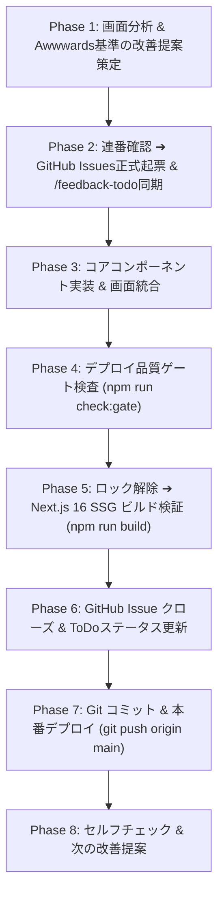

# Awards-Driven Quality Cycle (Awwwards / Webby / FWA 基準自律反復改善スキル)

## 1. 概要と目標（Purpose & Target）

本スキルは、MightyLINK AI Park において、世界最高峰のデザインアワード（**Awwwards Site of the Day / Mobile of the Day**, **Webby Awards**, **FWA of the Day**）水準の体験価値・完成度を達成・維持するために、以下の5要素を自律的反復ループで実現する標準手順書です。

### 5大クオリティ基準（The 5 Pillars of Excellence）
1. **Kinematics & Micro-Interactions (滑らかな動的演出)**:
   - ルート遷移時のシネマティックネオンレーザー（[`RouteProgress.tsx`](file:///c:/Users/kanta/GitHub/ai-park/src/components/RouteProgress.tsx)）
   - 数値の動的カウントアップ（[`AnimatedCounter.tsx`](file:///c:/Users/kanta/GitHub/ai-park/src/components/AnimatedCounter.tsx): `requestAnimationFrame` + `easeOutExpo`）
   - 円形SVGプログレスリング＆ネオングロー（[`AcademyProgressHUD.tsx`](file:///c:/Users/kanta/GitHub/ai-park/src/components/academy/AcademyProgressHUD.tsx)）
   - 診断・入力完了時のズームインキネマティクス（`animate-in fade-in zoom-in-95 duration-500`）
2. **Tactile Haptics & Audio (Web Audio API 触感音響)**:
   - スロットル制御された微小ホバーパルス（`playCyberHover`）
   - 直感的なクリック音（`playCyberClick` / `playCyberOpen`）
   - アクション完了・安全判定クリア時の2音和音シンセハーモニー（`playCyberSuccess`）
   - グローバルON/OFFスイッチ（`AudioToggle`）およびキーボード `M` トグル
3. **Depth, Perspective & Lighting (立体感とライティング)**:
   - マウス追従の微小3Dパースペクティブ傾斜＆グレア光沢（[`TiltCard.tsx`](file:///c:/Users/kanta/GitHub/ai-park/src/components/TiltCard.tsx)）
   - カーソル追従スポットライト（[`SpotlightCard.tsx`](file:///c:/Users/kanta/GitHub/ai-park/src/components/SpotlightCard.tsx)）
   - 多層パララックス視差移動（[`HeroBanner.tsx`](file:///c:/Users/kanta/GitHub/ai-park/src/components/HeroBanner.tsx)）
4. **Issue & Task Transparency (課題・改善の完全透明化)**:
   - GitHub Issues への正式起票（`gh issue create`）とToDo ID（`TODO-XX`）の厳密な連番採番
   - ご意見・改善ToDoボード（[`src/app/feedback-todo/page.tsx`](file:///c:/Users/kanta/GitHub/ai-park/src/app/feedback-todo/page.tsx)）への完全同期
   - 実装完了後の Issue 自動クローズ（`gh issue close --comment`）とステータス `done` 反映
5. **Zero-Defect Quality Gate & SSG (完全な品質防衛)**:
   - 事実確認・未連携機能ガード（`UnderConstructionAlert`）
   - デプロイ前品質ゲート検査（`npm run check:gate`）
   - Next.js 16 SSG ビルド（全49ルート静的生成、エラー0件）
   - `prefers-reduced-motion` とレスポンシブ（モバイル〜4K）のアクセシビリティ担保

---

## 2. 反復実行ワークフロー（Step-by-Step Procedure）



### Phase 1: 画面分析 & Awwwards基準の改善提案策定
- 現行画面のキネマティクス、音響、立体感、可読性を診断する。
- 以下のデザインパターンから適切な強化技術を選定：
  - **数値KPIカード**: `AnimatedCounter`（指数減速イージング `easeOutExpo`）
  - **カードグリッド・事例集**: `TiltCard`（3D傾斜＋動的グレア）＋ `SpotlightCard`
  - **進捗・受講・ステータス**: 円形SVGゲージHUD（`AcademyProgressHUD` パターン）
  - **診断・フォーム**: 回答進捗HUDバー ＋ `playCyberClick` ＋ `playCyberSuccess` ＋ ズームイン
  - **ボタン・タブ・モーダル**: `playCyberClick` / `playCyberHover` / `playCyberOpen` / `playCyberSuccess`
  - **ページ遷移・グローバルUI**: `RouteProgress`

### Phase 2: 連番確認 ➔ GitHub Issues 正式起票 & /feedback-todo 登録
1. **末尾番号の事前確認**:
   [`src/app/feedback-todo/page.tsx`](file:///c:/Users/kanta/GitHub/ai-park/src/app/feedback-todo/page.tsx) の `initialFeedbackList` 末尾を読み、最後のToDo番号（例: `TODO-30`）を確認。次の番号（`TODO-31`, `TODO-32`...）を必ず連番で付与する。
2. **GitHub CLI による正式起票**:
   ```powershell
   gh issue create --title "【カテゴリ】タイトル (TODO-XX)" --body "### 概要`n...`n### 対象ページ`n...`n### 要件`n..." --label "feedback"
   ```
3. [`src/app/feedback-todo/page.tsx`](file:///c:/Users/kanta/GitHub/ai-park/src/app/feedback-todo/page.tsx) の `initialFeedbackList` に新しいToDoアイテムを追加：
   - `id`: `"TODO-XX"`
   - `title`: タイトル
   - `category`: カテゴリー
   - `priority`: 優先度
   - `status`: `"in_progress"` または `"todo"`
   - `feedbackQuote`: 課題・要望引用
   - `actionPlan`: 具体的実装計画
   - `issueNumber`: 起票されたIssue番号
   - `issueUrl`: IssueのURL

### Phase 3: コアコンポーネント実装 & 画面統合（実装標準）

#### 1. TiltCard × SpotlightCard ネスト標準パターン
```tsx
<TiltCard maxTilt={6} glareOpacity={0.12} className="h-full rounded-2xl">
  <SpotlightCard spotlightColor="rgba(99, 102, 241, 0.18)" className="h-full">
    <Link
      href="/path"
      onClick={() => playCyberClick()}
      onMouseEnter={() => playCyberHover()}
      className="group relative flex flex-col justify-between h-full p-6"
    >
      {/* カードコンテンツ */}
    </Link>
  </SpotlightCard>
</TiltCard>
```

#### 2. インタラクティブ・診断HUD標準パターン
```tsx
// 回答進捗率
const answeredCount = [ans1, ans2, ans3].filter((a) => a !== null).length;
const progressPercent = Math.round((answeredCount / 3) * 100);

// クリック時サウンド
const handleSelect = (idx) => {
  playCyberClick();
  // 完了かつ合格時
  if (isCompleted && isClean) {
    setTimeout(() => playCyberSuccess(), 180);
  }
};

// 結果表示コンテナ
{isCompleted && (
  <div className="animate-in fade-in zoom-in-95 duration-500">
    {/* 結果カード */}
  </div>
)}
```

#### 3. 構文防衛ルール
- **重複インポート厳禁**: 同一モジュール（`@/lib/sound` 等）からのインポート重複を避ける（Webpackパースエラーの未然防止）。
- **閉じタグの完全整合**: `TiltCard`, `SpotlightCard` などのネスト変更時は、開始タグと閉じタグの数が1対1で対応していることを確認する。

### Phase 4: デプロイ品質ゲート検査（`npm run check:gate`）
- `npm run check:gate`（`scripts/verify-deployment-gate.mjs`）を実行。
- `isVerified: false` の全機能に工事中・準備中・サンプルの注記が存在すること、手動UAT承認が揃っていることを確認。
- 終了コードが 0 であることを確認。

### Phase 5: Next.js 16 プロダクションビルド（`npm run build`）
- PowerShell環境ではビルドロックの解除を前置して実行：
  ```powershell
  if (Test-Path .next/lock) { Remove-Item .next/lock -Force } ; npm run build
  ```
- 49ルートすべてのSSG（静的プリレンダリング）がエラーゼロで完了することを確認。

### Phase 6: GitHub Issue クローズ & ToDoステータス更新
1. [`src/app/feedback-todo/page.tsx`](file:///c:/Users/kanta/GitHub/ai-park/src/app/feedback-todo/page.tsx) 内の該当ToDoステータスを `"done"` に更新し、actionPlanを `【反映済み】...` に書き換える。
2. GitHub Issue に完了エビデンス（実装内容・適用コンポーネント・品質ゲート結果）をコメントしてクローズ：
   ```powershell
   gh issue close <ISSUE_NUMBER> --comment "【実装完了】TODO-XX の対応を完了しました。`n- ...`n- 品質ゲート（npm run check:gate）完全合格を確認"
   ```

### Phase 7: Git コミット & 本番デプロイ
1. `git status` で変更内容を精査。
2. Windows PowerShell では `&&` ではなく `;` を使用してコミット＆プッシュを実行：
   ```powershell
   git add src/ scripts/ .agents/ ; git commit -m "feat(awards-excellence): ..." ; git push origin main
   ```

### Phase 8: セルフチェック & 次の改善提案
1. ユーザーに対して、実施内容・Issueリンク・ビルド結果・デプロイ状態を報告。
2. 次のクオリティアップ施策を自律的に提案・実行する。

---

## 3. 再利用可能コンポーネント資産カタログ

| コンポーネント | パス | 特徴・技術仕様 |
| :--- | :--- | :--- |
| **RouteProgress** | [`src/components/RouteProgress.tsx`](file:///c:/Users/kanta/GitHub/ai-park/src/components/RouteProgress.tsx) | ページ遷移検知・シネマティックネオンレーザーバー（`<Suspense>` 安全設計） |
| **AnimatedCounter** | [`src/components/AnimatedCounter.tsx`](file:///c:/Users/kanta/GitHub/ai-park/src/components/AnimatedCounter.tsx) | 60fpsイージング（`requestAnimationFrame` + `easeOutExpo`）、小数点・単位対応 |
| **TiltCard** | [`src/components/TiltCard.tsx`](file:///c:/Users/kanta/GitHub/ai-park/src/components/TiltCard.tsx) | 3Dパースペクティブ傾斜（`rotateX` / `rotateY`）＋動的光沢ハイライト（Glare）＋触覚音響 |
| **SpotlightCard** | [`src/components/SpotlightCard.tsx`](file:///c:/Users/kanta/GitHub/ai-park/src/components/SpotlightCard.tsx) | カーソル追従の光彩グラデーションオーバーレイ |
| **AcademyProgressHUD** | [`src/components/academy/AcademyProgressHUD.tsx`](file:///c:/Users/kanta/GitHub/ai-park/src/components/academy/AcademyProgressHUD.tsx) | 円形SVGサイバープログレスリング（ネオングロー）＆ランク称号バッジHUD |
| **Web Audio API サウンド** | [`src/lib/sound.ts`](file:///c:/Users/kanta/GitHub/ai-park/src/lib/sound.ts) | `playCyberClick`, `playCyberHover` (60msスロットル), `playCyberSuccess`, `playCyberOpen` |
