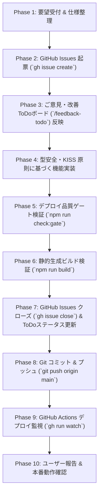

# MightyLINK AI Park: フィードバック起点開発・本番デプロイ反復実行スキル

本スキルは、MightyLINK AI Park において社内ユーザーやステークホルダーからのフィードバック・機能提案・改善要望を受けた際、**「ご意見・改善ToDoボードとGitHub Issuesを同期起票し、品質ゲートを遵守しながら型安全に実装・テストし、本番デプロイまで確実に完遂する」** ための標準反復手順書です。

---

## 1. ワークフロー概要（End-to-End Workflow）



---

## 2. フェーズ別標準手順書

### Phase 1: 要望受付 & 仕様整理
1. ユーザーからの要望・提案を以下の観点で整理する：
   - **ID**: `TODO-XX`（既存の末尾番号に続く新規ID）
   - **タイトル**: `【カテゴリ】具体的機能名（英語識別子/HUD等）`
   - **カテゴリ**: `UI/UX`, `AI実践編`, `運用・管理`, `基盤・セキュリティ` 等
   - **提案者・部署**: 社内の実在部署・担当者（例: `全社開発・AI推進`, `AI推進担当・インフラ部` 等）
   - **優先度**: `高`, `中`, `低`
   - **フィードバック引用（feedbackQuote）**: 社員・ユーザーの生の要望テキスト
   - **対応方針（actionPlan）**: 実装する具体的なアーキテクチャ・技術アプローチ

---

### Phase 2: GitHub Issues 起票 (`gh issue create`)
PowerShell ターミナルから `gh` CLI を使用して、各 TODO に対応する GitHub Issue を起票する。

```powershell
gh issue create --title "【カテゴリ】タイトル (TODO-XX)" --body @"
## 概要
<要望の要約>

## ユーザーからのフィードバック引用
> <feedbackQuote>

## 対応方針・実装タスク
- [ ] <タスク1>
- [ ] <タスク2>
- [ ] 品質ゲート検証 (npm run check:gate)
- [ ] 本番ビルド検証 (npm run build)
"@
```
※ コマンド実行後、発行された Issue 番号（例: `#20`）と Issue URL を取得・記録する。

---

### Phase 3: ご意見・改善ToDoボード（`src/app/feedback-todo/page.tsx`）への反映
`src/app/feedback-todo/page.tsx` の `initialFeedbackList` 配列に、取得した Issue 番号・URL を含めて追加する。

```typescript
  {
    id: "TODO-XX",
    title: "【カテゴリ】タイトル",
    category: "UI/UX",
    author: "社内ユーザー提案",
    authorDept: "全社開発・AI推進",
    date: "2026/10/03",
    priority: "高",
    status: "in_progress", // 着手前は "todo", 実装中は "in_progress"
    feedbackQuote: "「ユーザーの生の声」",
    actionPlan: "【対応中】実装アプローチの詳細解説...",
    relatedLink: "/gemini-stats",
    relatedLinkText: "関連画面を見る",
    issueNumber: 20,
    issueUrl: "https://github.com/kanta13jp1/ai-park/issues/20",
  },
```

---

### Phase 4: 型安全・KISS 原則に基づく機能実装
1. **Next.js 16 (SSG / Static Export) の安全設計**:
   - `localStorage` やブラウザ専用 API は必ず `useEffect` 内で呼び出す。
   - 初期プリレンダリング時（SSG）にデータが `undefined` または空配列でもクラッシュしないよう、オプショナルチェイニング（`?.`）と Null 合体演算子（`??`）を徹底する。
     ```typescript
     // 例: 安全なデータアクセス
     const done = (progress?.lessonsDone?.length ?? 0) + ((progress?.bestScore ?? 0) >= PASS_RATE ? 1 : 0);
     ```
2. **KISS & YAGNI の徹底**:
   - 不要な外部ライブラリを追加せず、標準の React / Tailwind CSS / Web API（`requestAnimationFrame`, `crypto` 等）でシンプルかつ堅牢に実装する。
3. **機密情報の保護**:
   - API キーやサービスアカウント JSON はコードにハードコードせず、環境変数（`process.env.GCP_SA_KEY` 等）または安全なフォールバック設計を行う。

---

### Phase 5: デプロイ品質ゲート検証 (`npm run check:gate`)
実装後、コミット前に必ず社内品質ゲートを実行する。

```powershell
npm run check:gate
```

**ゲート検証項目**:
- 事実確認中の画面（`/tools`, `/interviews`, `/ambassadors` 等）に工事中・準備中注記が存在するか。
- 公開中画面（`/`, `/guide`, `/learning`, `/gemini-stats`, `/ai-projects`, `/feedback-todo`, `/preflight`）の 4大評価軸（仕様・デザイン・操作性・視認性）手動UATが合格しているか。

---

### Phase 6: 静的生成ビルド検証 (`npm run build`)
Next.js の本番ビルドを実行し、全静的ルートの生成（SSG）と TypeScript 型整合性を検証する。

```powershell
npm run build
```
- `✓ Generating static pages using 1 worker (49/49)` のように、全ページがエラーなく生成されることを確認する。

---

### Phase 7: GitHub Issues クローズ & ToDoステータス更新
1. **GitHub Issues のクローズ**:
   ```powershell
   gh issue close <issue_number> --comment "【完了】<実装内容の要約>"
   ```
2. **ToDoボード（`src/app/feedback-todo/page.tsx`）の更新**:
   - `status: "done"`
   - `actionPlan`: `【反映済み】...` に更新

---

### Phase 8: Git コミット & プッシュ
変更ファイルをステージングし、標準的な Conventional Commits 形式でコミットしてリモートにプッシュする。

```powershell
git add .
git commit -m "feat(<scope>): complete TODO-XX with <feature_summary>"
git push origin main
```

---

### Phase 9: GitHub Actions デプロイ監視 (`gh run watch`)
プッシュによってトリガーされた GitHub Actions（GitHub Pages デプロイ）を監視し、成功を確認する。

```powershell
# 最新の実行IDを確認
gh run list --limit 1

# 実行完了までリアルタイム監視
gh run watch <run_id> --interval 5
```
- `✓ build in XXs`
- `✓ deploy in XXs`
両ジョブが `✓` で完了することを確認する。

---

### Phase 10: ユーザー報告 & 本番動作確認
1. 本番 URL（`https://kanta13jp1.github.io/ai-park/<page>`）をブラウザで開き、新機能が正しく動作することを確認する。
2. ユーザーへ完了報告を作成する（実装サマリー表、検証結果、Issue リンクを明記）。

---

## 3. クイック実行コマンド集（PowerShell）

```powershell
# 1. 品質ゲートとビルドの一括検証
npm run check:gate; npm run build

# 2. Issue の起票例
gh issue create --title "【UI/UX】〇〇の改善 (TODO-28)" --body "社内要望に基づき〇〇を実装します。"

# 3. Issue の完了処理例
gh issue close 28 --comment "【完了】〇〇を実装し本番デプロイを完了しました。"

# 4. デプロイ監視
gh run watch (gh run list -L 1 --json databaseId -q ".[0].databaseId")
```

---

## 4. トラブルシューティング & ベストプラクティス

| 現象・エラー | 原因 | 対処方法 |
| :--- | :--- | :--- |
| `TypeError: Cannot read properties of undefined` in SSG build | 静的ビルド時に `localStorage` や未取得状態のデータに直接プロパティアクセスしている | 対象箇所に `?.`（オプショナルチェイニング）と `??`（デフォルト値）を追加する。 |
| `npm run check:gate` が失敗する | 未検証画面から工事中バッジが外れている、または手動UATエビデンスのフォーマット不一致 | `src/data/feature-status.ts` および `src/data/preflight-checklist.ts` の定義を確認・修正する。 |
| GitHub Actions が `cancelled` または再実行される | 短時間に複数の push や issue イベントが発生し前ジョブがキャンセルされた | 最新の push に紐づく Run ID を `gh run list` で特定し、そちらを監視する。 |
| 本番環境で画面が即時更新されない | GitHub Pages またはブラウザの静的アセットキャッシュ | ブラウザで `Ctrl + F5`（スーパーリロード）を実行する。 |
