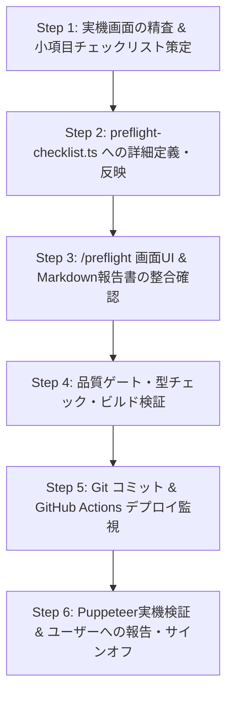

# MightyLINK AI Park: プリフライト手動UAT＆品質ゲート反復実行スキル

本スキルは、MightyLINK AI Park において新機能の公開や画面の更新を行う際、**「自動テストのみに頼らず、開発者が実際に画面を手動確認（UAT）し、全基準を満たした機能だけを公開する」** という厳格な社内品質方針を反復・確実に実行するための標準手順書です。

---

## 1. 根本方針と安全原則（Core Philosophy）

1. **嘘や推測の徹底排除（No Fiction, No Speculation）**:
   - 社員向けに公開しているポータルであるため、事実でない情報や推測・未確定のデータが含まれていてはならない。
   - 実在する組織（株式会社Mighty LINK）、実在する担当者（AI推進担当・梅澤）、実在する基盤（GCPプロジェクトID: `antigravity-pj-509006`）、実在する社内規程・アナウンスのみを記載する。
2. **未検証機能の厳格ガード（Under Construction Guards）**:
   - 事実確認が取れていない機能、実データ連携前のデモ画面、開発途中の機能は、必ず `🚧 工事中` `📋 準備中` `🧪 PoC中` として明示し、ユーザーに「本番稼働中」と誤認させない。
   - スクリプト `scripts/verify-deployment-gate.mjs` によるビルドゲート（Quality Gate）で未ガードの混入を機械的に阻止する。
3. **4大評価軸の全項目手動合格（100% Manual Verification Required）**:
   - ①仕様・事実確認、②デザイン・レイアウト、③操作性・機能性、④視認性・分かりやすさのすべてにおいて開発者が実機で手動点検し、合格エビデンスを記録する。

---

## 2. 手動受入テスト（UAT）4大評価軸と詳細点検観点

開発者が実機（Windows 11 / Chrome / 1920x1080 ＋ モバイル実機エミュレーション）で手動点検する観点は以下の通りです。

### ① 仕様・事実確認（Fact & Spec）
- **嘘や推測のデータがないか（事実性・実在性）**:
  - 架空の会社名、部署名、担当者名、プロジェクトIDが書かれていないか。
  - 実態と異なるモデル（利用不可能なモデル）や過剰な権限を謳っていないか。
  - 数値（レッスン数、開催時間、料金など）が正確か。
  - 社員のフィードバック引用が社内Chat等の実在発言に基づいているか。
- **公式アナウンス・安全基準と一致しているか（整合性・周知遵守）**:
  - 全社周知されたポータルの目的・スローガン・推奨導線と一致しているか。
  - 社内AI利用ガイドライン（個人情報・社外秘の入力禁止、会社アカウント利用徹底）に準拠しているか。
  - 相談窓口やOffice Hourのスケジュールが最新かつ正確か。
- **リンク先が実在するか（リンク検証・実在性）**:
  - ページ内のすべての内部リンクおよび外部リンク（Google公式ドキュメント、コンソール等）が実在し、404エラーなく疎通すること。

### ② デザイン・レイアウト（Aesthetics）
- **レスポンシブ崩れの排除**:
  - デスクトップ（1920x1080）、ノートPC、タブレット、スマホ（375px〜430px）で要素のはみ出しや不自然な改行がないか。
- **視覚的調和**:
  - フォントサイズ、行間、余白（padding/margin）が適切に保たれているか。
  - 背景グラデーション、カードの境界線、シャドウ、グロー効果がダーク/ライト環境で美しく調和しているか。
- **コードブロック・表の可読性**:
  - ソースコードやコマンド表示に適切なシンタックスハイライト、折り返し、または横スクロールが適用されているか。

### ③ 操作性・機能性（Usability）
- **軽快なインタラクション**:
  - ボタンやリンクのクリック、タブ切り替え、モーダル開閉、アコーディオンの展開が遅延なくスムーズに動くか。
- **機能の確実な動作**:
  - 「コピー」ボタンでクリップボードに正確な文字列が保存されるか。
  - 外部リンクが `target="_blank" rel="noopener noreferrer"` で別タブで安全に開くか。
  - 診断ツールやインタラクティブフォームが正確にリアルタイム計算・判定を行うか。
- **アクセシビリティ・キーボード操作**:
  - `Tab` キーや `Esc` キー、ショートカット（⌘K / Ctrl+K）が意図通り動作するか。

### ④ 視認性・分かりやすさ（Readability）
- **平易な日本語と明快な解説**:
  - 専門用語や略称（MCP, IDE, API, Spend cap等）に初学者向けの平易な解説・補足があるか。
  - 手順がステップ番号（STEP 1, 2...）で視覚的に整理され、迷わず追えるか。
- **不自然な単語泣き別れ・孤立文字の排除（タイポグラフィ品質）**:
  - 助詞・助動詞や単語の一部（例: 「篇）」「ト」「の」等）だけが次の行に孤立改行される不格好なレイアウトを排除する。
  - 必要に応じて `inline-block`, `break-keep`, `whitespace-nowrap` や適切な改行指定を行い、美しく読みやすい行送りを担保する。
- **実務に即したデフォルト表示・フィルター優先設定**:
  - 一覧・ToDo・課題画面などでは、完了済みよりも「⚡ 未対応（対応中＋検討中）」などのアクション待ち項目を初期表示し、実務で最も必要な情報へワンアクションで到達できるようにする。
- **警告・注意事項のハイライト**:
  - 業務利用時のセキュリティ注意点や禁止事項が、目立つアイコンやカラー（アンバー・レッド枠）で強調されているか。
- **次のアクションの明確化**:
  - 各ステップやセクションを読み終わった後、ユーザーが次にどのボタンを押せばよいかが一目でわかるか。

---

## 3. 反復実行ワークフロー（Step-by-Step Procedure）

新しい画面を追加・更新・公開する際は、以下のステップを順番に実施します。



### Step 1: 実機画面の精査 & 小項目チェックリスト策定
1. ブラウザまたはDevToolsで対象画面（例: `/learning`, `/ai-projects` 等）を開く。
2. ページ内に記載されているすべての情報（文言、リンク、担当者、コード、手順、診断ロジック）を洗い出す。
3. 仕様・事実確認（Fact & Spec）を以下の3グループに分類し、具体的な点検小項目（`DetailedSubCheck` 計10項目）を作成する：
   - `① 嘘や推測のデータがないか（事実性・正確性検証）`（4項目）
   - `② 公式アナウンス・安全基準と一致しているか（整合性・周知遵守）`（3項目）
   - `③ リンク先が実在するか（リンク検証・確認済み）`（3項目）

### Step 2: プリフライトマスター（`src/data/preflight-checklist.ts`）への反映
1. `src/data/preflight-checklist.ts` の対象レコードを開く（新規画面の場合はレコードを追加）。
2. `checks.factAndSpec` に以下を定義する：
   - `points`: 評価ポイントの一覧配列
   - `evidence`: 検証結果のエビデンス要約文字列
   - `subChecks`: `DetailedSubCheck` 10項目の配列（ID, category, groupTitle, label, detail, verified: true）
3. `checks.designAndLayout`, `checks.usability`, `checks.readability` の points と evidence も実態に合わせて更新する。
4. `lastVerifiedAt`（検証日付）および `verifiedBy`（検証担当者）を最新化する。

### Step 3: `/preflight` 画面UI & Markdown報告書の整合確認
1. `src/app/preflight/page.tsx` において、対象レコードを選択した際に詳細小項目がグループ別に美しく表示されるか確認する。
2. 「UAT報告書をMarkdownでコピー」機能で、詳細チェック項目が正しく出力されることを確認する。

### Step 4: 品質ゲート・型チェック・ビルド検証
ターミナル（PowerShell）で以下の検証コマンドを順番に実行し、すべて合格することを確認する。

```powershell
# 1. デプロイ品質ゲート検証（未連携機能ガード & 手動UAT合格確認）
npm run check:gate

# 2. TypeScript型チェック
npx tsc --noEmit

# 3. Next.js本番ビルド（49ルートSSG生成）
npm run build
```

### Step 5: Git コミット & GitHub Actions デプロイ監視
検証合格後、コミット・プッシュし、GitHub Actions の自動デプロイを監視する。

```powershell
# コミット & プッシュ
git add src/data/preflight-checklist.ts
git commit -m "feat(preflight): granular sub-checklist for fact & spec on <page> page"
git push origin main

# GitHub Actions の実行IDを取得して監視
gh run list --workflow deploy.yml -L 1
gh run watch <run_id>
```

### Step 6: Puppeteer実機検証 & ユーザーへの報告・サインオフ
1. Puppeteer MCP ツール等を用いて本番URL（キャッシュバスター付与: `?cachebust=<timestamp>`）へアクセス。
2. クリック操作、リスト絞り込み、レスポンシブ崩れの有無を実機評価。
3. スクリーンショットを撮影して保存・確認。
4. ユーザーに対して、各小項目の点検根拠と合格判定の要約を報告し、サインオフを得る。

---

## 4. 新規画面追加時のオンボーディング規約（New Page Onboarding）

新しい画面・ページ（例: `/news` など）をポータルに追加する際は、以下のルールを厳守します：

1. **実在データまたは誠実なステータスガード**:
   - 外部APIや実データと連携して公開する場合は、事実性・実在性を担保する。
   - 準備中や開発途中の場合は、即座に `🚧 工事中` `📋 準備中` `🧪 PoC中` のバッジを付与し、`scripts/verify-deployment-gate.mjs` にリストアップして品質ゲートを通過させる。
2. **ナビゲーションと検索への統合**:
   - `src/components/Sidebar.tsx` の適切なグループ（「使い方・学び」「エージェント・ツール」「コミュニティ」等）にメニュー項目を追加。
   - `src/lib/searchIndex.ts`（またはサイト内横断検索インデックス）にルートとキーワードを登録。
3. **Awards水準のUI/UXと触感音響**:
   - `HeroBanner`, `SpotlightCard`, `TiltCard` による一貫した高品質デザイン。
   - ホバー音（`playCyberHover`）、クリック音（`playCyberClick`）の適用。

---

## 5. チェックリスト・報告書テンプレート

ユーザーへの確認依頼や報告書作成時は、以下のフォーマットに準拠します。

```markdown
### 📋 <画面名> 仕様・事実確認（Fact & Spec）詳細チェックリスト

#### ① 嘘や推測のデータがないか（事実性・実在性検証）
- [x] **<項目名>**: <具体的な点検内容と検証結果>
- [x] **<項目名>**: <具体的な点検内容と検証結果>

#### ② 公式アナウンス・安全基準と一致しているか（整合性・周知遵守）
- [x] **<項目名>**: <具体的な点検内容と検証結果>
- [x] **<項目名>**: <具体的な点検内容と検証結果>

#### ③ リンク先が実在するか（リンク検証・確認済み）
- [x] **全内部・外部リンクの疎通確認**: <遷移先とステータス>

---

### 🛡️ 4大評価軸の総合判定
- **① 仕様・事実確認（Fact & Spec）**: 【合格】（エビデンス: ...）
- **② デザイン・レイアウト（Aesthetics）**: 【合格】（エビデンス: ...）
- **③ 操作性・機能性（Usability）**: 【合格】（エビデンス: ...）
- **④ 視認性・分かりやすさ（Readability）**: 【合格】（エビデンス: ...）
```

---

## 6. トラブルシューティング

- **ビルドゲート（`npm run check:gate`）でエラーが出る場合**:
  - 未連携機能に `🚧 工事中` `📋 準備中` `🧪 PoC中` 等の注記が漏れていないか確認する。
  - `preflight-checklist.ts` 内の `passed: true` や `evidence` 文字列の記述形式が正規表現と一致しているか確認する。
- **デプロイ後に画面が更新されない場合**:
  - GitHub Pages / CDN のキャッシュの影響があるため、URLに `?cachebust=<現在時刻>` を付与するか、ブラウザでスーパーリロード（`Ctrl+F5` または `Shift+Reload`）を行う。

