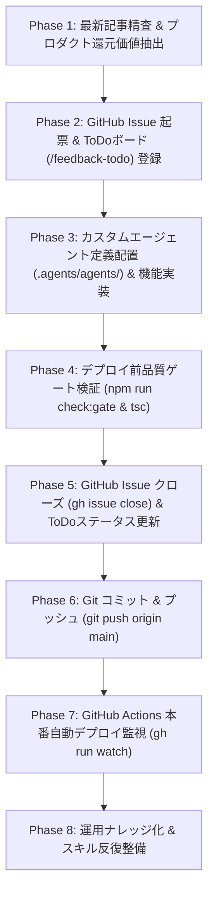

# MightyLINK AI Park: 最新技術記事起点・機能還元＆本番デリバリー標準スキル (tech-to-production-pipeline)

本スキルは、Google Antigravity や各社基盤モデルの公式アナウンス・技術ブログ等の最新動向を調査・インプットした際、**「単なるニュース閲覧・紹介で終わらせず、自社プロダクト・社内AIポータル（AI Park）へ還元できる機能価値を抽出し、ToDo起票からエージェント・機能実装、品質ゲート検証、クローズ、本番デプロイまでを一気通貫で完遂する」** ための標準反復手順書です。

---

## 1. 全体ワークフロー（End-to-End Pipeline）



---

## 2. フェーズ別標準手順書

### Phase 1: 最新記事精査 & プロダクト還元価値抽出
1. **対象技術の調査**:
   - 公式アナウンス・ブログ記事（例: Google Antigravity 公式ブログ）の本文を取得し、発表された技術仕様、新機能、CLIコマンド、設定形式を精査する。
2. **AI Park への還元ポイントの特定**:
   - **機能還元軸**: 社内ポータル（AI Park）の既存機能（`/news`, `/guide`, `/agent-cases`, `/skills-hub`, `/tools-hub` 等）とどう連動できるか？
   - **開発効率・品質向上軸**: ポータル自身の開発・リリースパイプラインにそのアーキテクチャ（例: リリース前事前監査ゲート）を適用できるか？
   - **社内開発者支援軸**: 社内エンジニアが自分のプロジェクトへ即座に流用できるテンプレートやCLIワンライナーを提供できるか？

---

### Phase 2: GitHub Issue 起票 & ToDoボード（`/feedback-todo`）登録
1. **GitHub Issue の起票 (`gh issue create`)**:
   ```powershell
   gh issue create --title "【カテゴリ】機能名・目的 (TODO-XX)" --body @"
   ## 概要
   <公式技術記事の要約とポータルへの還元価値>

   ## 課題・背景
   - <社内の現状課題や活用の必要性>

   ## 実施内容
   1. <UI/カタログ/新機能の実装>
   2. <カスタムエージェント定義の配置>
   3. <デプロイ前品質ゲート検証>
   4. <ToDoボードの更新とクローズ>
   "@ --label "enhancement,feedback,status:in-progress"
   ```
2. **ご意見・改善ToDoボード（`src/app/feedback-todo/page.tsx`）への反映**:
   - `initialFeedbackList` の末尾に `TODO-XX` を追加。
   - 発行された Issue 番号（`issueNumber`）と URL（`issueUrl`）を紐付け。
   - `status: "in_progress"`（または実装完了時 `done`）に設定。

---

### Phase 3: カスタムエージェント定義配置 & 機能実装
1. **カスタムエージェント定義（`.agents/agents/<name>.md`）の作成**:
   - Antigravity 2.0 準拠の YAML Frontmatter とマークダウン仕様書を作成：
     ```markdown
     ---
     name: agent-name
     description: エージェントの役割と目的
     tools:
       - run_command
       - view_file
     ---

     # Agent Title
     ## Strict Safety Constraints
     - Read-only, Fail-closed
     ## Audit / Execution Workflow
     - Phase 1: ...
     - Phase 2: ...
     ```
2. **社内実践カタログUI（`src/app/agent-cases/page.tsx` 等）の実装**:
   - エージェントの呼び出しコマンド（`agy --agent <name>`）のワンクリックコピーボタン。
   - 定義マークダウンのプレビューモーダル・コピー機能。
   - 触感音響（`playCyberClick()`）およびアクセシビリティ対応。

---

### Phase 4: デプロイ前品質ゲート検証 & 型チェック
1. **事実確認・未完了項目の検査 & 手動UAT受入テスト確認**:
   ```powershell
   npm run check:gate
   ```
   - 11画面の未確認・工事中注記（`UnderConstructionAlert`）の存在確認。
   - 登録された手動UAT受入テスト（4大評価軸: 仕様・デザイン・操作性・視認性）の全件合格を確認。
2. **TypeScript 型チェック**:
   ```powershell
   npx tsc --noEmit
   ```
3. **静的エクスポート整合性確認**:
   - `src/app/not-found.tsx` による 404 ハンドリング確認。
   - `public/data/ai-news-live.json` の JSON 構造妥当性確認。

---

### Phase 5: GitHub Issue クローズ & ToDoステータス更新
1. **GitHub Issue のクローズ (`gh issue close`)**:
   ```powershell
   gh issue close <issue-number> --comment "## ✅ 実装完了・クローズ報告
   - <実装した機能・UI>
   - <配置したエージェント定義>
   - 品質ゲート (npm run check:gate) 全件合格確認"
   ```
2. **ToDoボードのステータス更新**:
   - `src/app/feedback-todo/page.tsx` の該当 TODO の `status` を `"done"` に更新。

---

### Phase 6: Git コミット & 本番デプロイ監視
1. **変更のコミット & プッシュ**:
   ```powershell
   git add .
   git commit -m "feat(agents): <コミットメッセージ> (closes #<issue-number>)"
   git push origin main
   ```
2. **GitHub Actions ワークフロー監視**:
   ```powershell
   gh run list --workflow=deploy.yml -L 1
   gh run watch <run-id>
   ```

---

## 3. 実践ケーススタディ

### ケース1: Google公式ブログ「Custom agents in Google plugins」適用例
| 項目 | 実績内容 |
| :--- | :--- |
| **元記事** | [Custom agents in Google plugins](https://antigravity.google/blog/custom-agents-in-google-plugins) (2026/09/28) |
| **還元アイデア** | ① 社内開発者向け公式カスタムエージェント（Flutter / Firebase / Play Audit）実践カタログの提供<br>② AI Park専用デプロイ前総合リリース監査エージェント（`ai-park-release-audit`）の実装 |
| **起票ToDo** | `TODO-113`（Issue #112） |
| **成果物** | ・`.agents/agents/ai-park-release-audit.md`<br>・`.agents/agents/play-release-audit.md`<br>・`.agents/agents/flutter-a11y.md`<br>・`.agents/agents/firebase-rules.md`<br>・`src/app/agent-cases/page.tsx` カタログUI & モーダル<br>・`src/app/feedback-todo/page.tsx` TODO-113 クローズ |
| **品質ゲート** | `npm run check:gate` 全13件手動UAT合格確認、`npx tsc --noEmit` ノーエラー通過 |

### ケース2: OpenAI公式ブログ「Bringing my LED display to life」適用例
| 項目 | 実績内容 |
| :--- | :--- |
| **元記事** | [Bringing my LED display to life with GPT-Live-1 and Codex](https://developers.openai.com/blog/bringing-my-led-display-to-life) (2026/10/02) |
| **還元アイデア** | ① 全二重音声対話×推論委譲×ローカルピクセルレンダリングの最新IoT技術解説ニュース配信<br>② 物理LEDサイネージ・HUDリアルタイム音声制御モデルケースの新設<br>③ IoT・物理ディスプレイ制御用カスタムエージェント（`iot-display-controller`）の配置 |
| **起票ToDo** | `TODO-114`（Issue #113） |
| **成果物** | ・`src/data/ai-news.ts` & `public/data/ai-news-live.json` ニュース解説追加<br>・`src/app/agent-cases/page.tsx` 物理サイネージモデルケース & カタログ追加<br>・`.agents/agents/iot-display-controller.md` エージェント定義配置<br>・`src/app/feedback-todo/page.tsx` TODO-114 クローズ |
| **品質ゲート** | `npm run check:gate` 合格、`npx tsc --noEmit` ノーエラー通過 |
