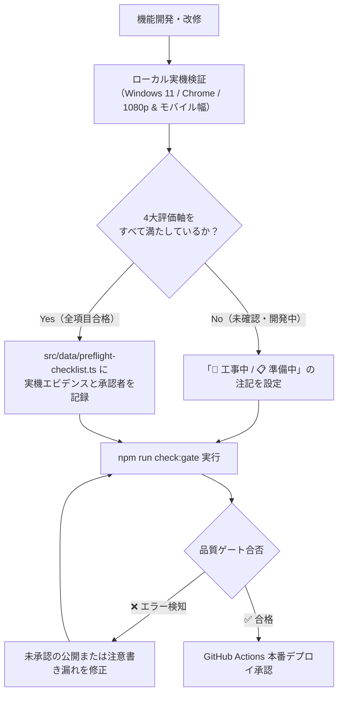

# 🛡️ MightyLINK AI Park: 開発者手動プリフライトチェック（UAT）実施ガイド

## 1. 目的と基本原則

MightyLINK AI Park は全社員向けに公開されている社内ポータルです。
**「万が一にも嘘の情報や推測データ、デザイン崩れ、動かないリンクがあれば大問題になる」**という厳格なポリシーのもと、自動テスト（ビルド・Linter）をパスするだけでなく、**開発者が実際に画面を操作して手動確認し、全項目を満たした機能のみを公開**します。

---

## 2. 4大評価軸（手動チェック項目）

開発者は機能の公開・ステータス更新前に、必ず社内実機環境（Windows 11 / Chrome 等）で以下の4つの観点をすべて点検します。

| 評価軸 | 確認内容 | 合格基準 |
| :--- | :--- | :--- |
| **① 仕様・事実確認 (Fact & Spec)** | 嘘・推測・未確認の社内規程やダミー数値がないか。 会社アカウント（`@ml-mightylink.com`）やGCP設定と合致しているか。 | 未連携・検証中の項目はすべて「🚧 工事中」「📋 準備中」「🧪 PoC中」の注意書きが表示されており、ユーザーが本番データと誤認しないこと。 |
| **② デザイン・見た目 (Design & Aesthetics)** | スタイルの崩れ、意図しない改行、はみ出しがないか。 配色コントラスト、ダーク/ライトの調和、余白の適切さ。 | PC（1920x1080）およびモバイル・タブレット幅で視覚的な破綻やオーバーフローがないこと。 |
| **③ 操作性・機能性 (Usability & Interaction)** | ボタンクリック、コピー機能、モーダル、ドロップダウンが意図通りに動くか。 404リンク切れやコンソールエラーがないか。 | すべての操作が軽快に反応し、エラー時に適切なフィードバックがあること。 |
| **④ 視認性・分かりやすさ (Readability & Guidance)** | 専門用語に適切な解説があるか。 ユーザーが次に何をすればよいかのアクションが一目瞭然か。 | 初心者でも迷わず読め、重要注意事項（黄色/赤色）が正しく認識できること。 |

---

## 3. UAT実施フロー

---

## 4. 管理コンソール・ツール

- **開発者用UATダッシュボード**: `/preflight`
  - ブラウザ上で各機能の手動UAT合格状況、確認エビデンス、特記事項を確認可能。
  - 「UAT報告書をMarkdownでコピー」ボタンで、プルリクエストや社内報告用テキストを1クリック生成。
- **デプロイ前自動検証スクリプト**: `npm run check:gate`
  - `package.json` の `"build"` コマンドの先頭に組み込まれており、UAT未承認機能や工事中注記漏れを自動遮断します。

---

## 5. 記録先ファイル

- **`src/data/preflight-checklist.ts`**: 各機能の手動確認記録（合格フラグ、確認日、担当者、エビデンス、確認環境）を定義。
- **`src/data/feature-status.ts`**: 全機能の公開ステータス（verified / in_development / poc_sample / draft）を定義。
